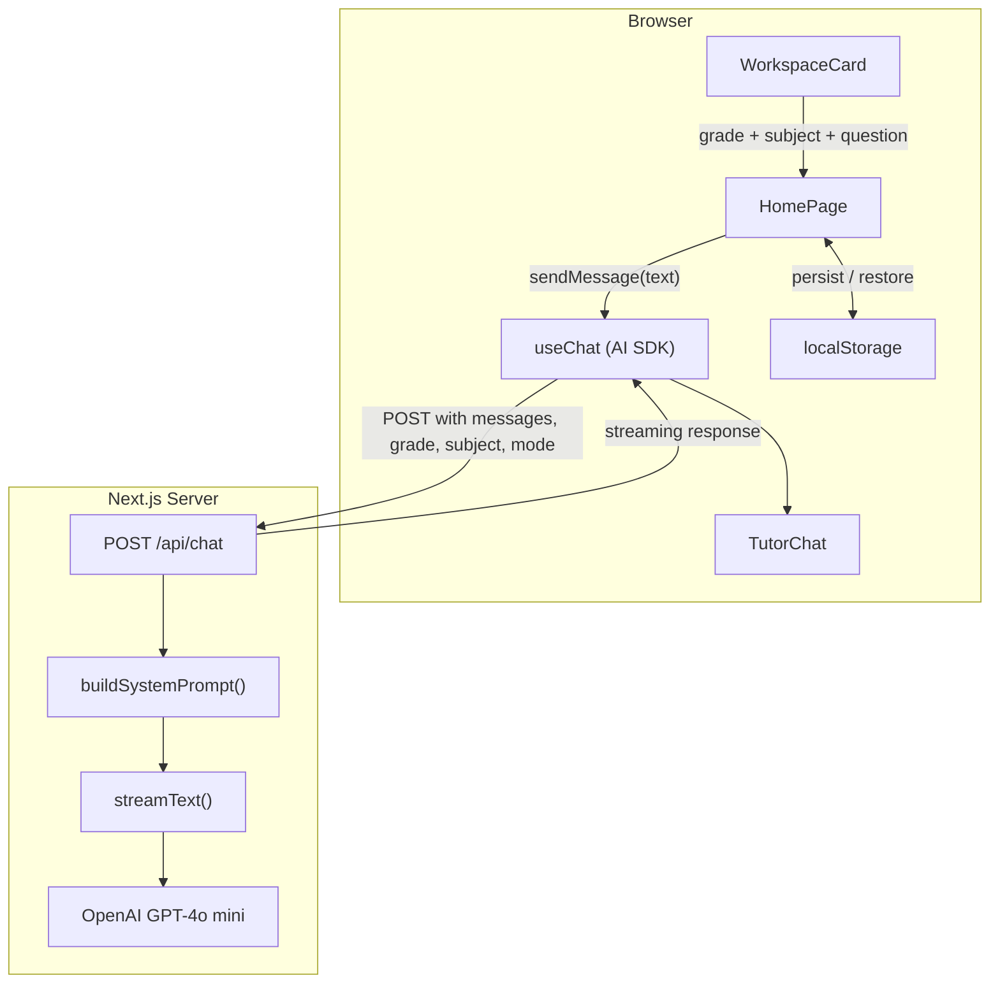

# Architecture

## Overview

BrighterTeach AI Homework Helper is a single-page Next.js application with one API route. The frontend collects a student's grade, subject, and question, sends it to a server-side route handler that constructs a grade-adaptive system prompt, streams the response from Google Gemini, and renders it in real-time.



## Frontend

### Layout

The page uses a two-panel grid layout (`lg:grid-cols-2`):

| Panel | Component | Role |
|-------|-----------|------|
| Left | `WorkspaceCard` | Grade selector, subject toggle (math/reading), question textarea, Explain + Hint buttons |
| Right | `TutorChat` | Message list with markdown rendering, follow-up input, thinking indicator |
| Top | `Header` | App title, "Start New Session" button (visible when history exists) |

### State Model

All state lives in `app/page.tsx`. There are no external state managers.

```
Session {
  grade: number        // 1-8
  subject: "math" | "reading"
  mode: "explain" | "hint"
  hasSubmitted: boolean // gates the chat lock
}
```

`useChat` from `@ai-sdk/react` manages the message array and streaming lifecycle (`status`, `sendMessage`, `setMessages`).

### Chat Lock

The right panel (TutorChat) starts disabled. The chat input and send button are locked until the user submits their first question via the left panel. This prevents empty conversations and guides kids through the intended flow: pick grade → choose subject → type question → get help.

The lock is controlled by `session.hasSubmitted` which flips to `true` on the first `handleSubmit` call.

### Persistence

Two `localStorage` keys keep state across page reloads:

| Key | Contents | Lifecycle |
|-----|----------|-----------|
| `brighterteach-messages` | Serialized `UIMessage[]` array | Written on every message change; cleared on "Start New Session" |
| `brighterteach-session` | Serialized `Session` object | Written after first submit; cleared on "Start New Session" |

On mount, `loadMessages()` and `loadSession()` read from storage with try/catch fallbacks to defaults.

### Key Files

| File | Responsibility |
|------|---------------|
| `app/page.tsx` | Root page component — state, `useChat`, event handlers, layout |
| `components/workspace-card.tsx` | Input form — grade select, subject toggle, textareas, action buttons |
| `components/tutor-chat.tsx` | Chat display — message bubbles, markdown rendering, follow-up input |
| `components/header.tsx` | App header — branding, session reset button |
| `lib/constants.ts` | Shared types (`Subject`, `Mode`) and config (`STORAGE_KEYS`, `HINT_PREFIX`) |

## Backend

### API Route: `POST /api/chat`

Single route handler in `app/api/chat/route.ts`. No database. Root `proxy.ts` handles security headers only (CSP, X-Frame-Options, X-Content-Type-Options, Referrer-Policy) — it does not touch routing or request bodies.

**Request body:**

```json
{
  "messages": [...],
  "grade": 3,
  "subject": "math",
  "mode": "explain"
}
```

**Validation:** rejects requests where grade is outside 1-8, subject is not `"math"` or `"reading"`, or mode is not `"explain"` or `"hint"`. Returns `400` on invalid input, `503` on AI service errors.

**Flow:**

1. Parse and validate request body
2. Call `buildSystemPrompt(grade, subject, mode)` to construct the system message
3. Call `streamText()` with the OpenAI model, system prompt, and converted messages
4. Return the streaming response via `toUIMessageStreamResponse()`

### Dynamic System Prompt

`lib/build-system-prompt.ts` assembles the prompt from three independent dimensions:

| Dimension | Logic |
|-----------|-------|
| **Tone** | `grade <= 4`: emojis, simple words, warm and enthusiastic. `grade >= 5`: academic but encouraging, age-appropriate for middle school. |
| **Subject** | Math: numbered steps, clear equation formatting. Reading: comprehension focus, context clues, main ideas. |
| **Mode** | Explain: complete step-by-step walkthrough. Hint: strict rule — one conceptual nudge, 2-3 sentences max, never reveal the answer. |

The final prompt is: `{tone}\n\n{subject}\n\nThe student is in grade {N}.\n\n{mode}`

### Streaming

The app uses Vercel AI SDK's streaming pipeline:

1. `streamText()` opens a streaming connection to Gemini
2. `toUIMessageStreamResponse()` converts it to a format `useChat` understands
3. The frontend renders tokens as they arrive — no waiting for the full response

## Design Decisions

**localStorage over a database.** This is a stateless MVP with no user accounts. localStorage gives instant persistence with zero infrastructure. The trade-off (data tied to one browser) is acceptable for a homework helper where sessions are short-lived.

**Single page.** A homework helper is a focused task: enter a question, get help. Multi-page navigation would add friction for kids without adding value. The two-panel layout keeps input and output visible simultaneously.

**Streaming responses.** Kids lose interest waiting for a loading spinner. Streaming makes the tutor feel alive — words appear as the model "thinks," which keeps attention and makes the interaction feel conversational.

**GPT-4o mini.** Fast inference, strong instruction-following, cost-effective for an MVP, and broadly familiar to developers. The Vercel AI SDK abstraction keeps the provider swap trivial if latency or cost trade-offs shift.

**No external state manager.** With one page and a handful of state values, `useState` + `useChat` is sufficient. Adding Redux or Zustand would be over-engineering for this scope.
